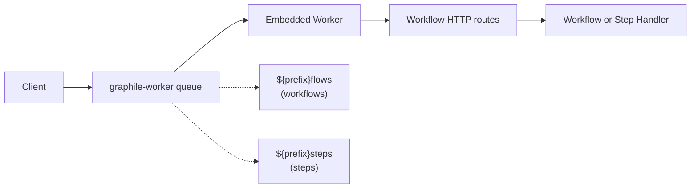

# How PostgreSQL World Works

This document explains the architecture and components of the PostgreSQL world implementation for workflow management.

This implementation is using [Drizzle Schema](./src/drizzle/schema.ts) that can be pushed or migrated into your PostgreSQL schema and backed by [node-postgres](https://node-postgres.com/) (`pg`). `createWorld` uses a single `pg.Pool` for Drizzle and graphile-worker (via `pgPool`), and a dedicated `pg.Client` for LISTEN/NOTIFY derived from the same connection options. You may pass your own pool to share query connections with application code.

If you want to use any other ORM, query builder or underlying database client, you should be able to fork this implementation and replace the Drizzle parts with your own.

## Job Queue System



Jobs include retry logic (3 attempts), idempotency keys, durable delayed rescheduling, and configurable worker concurrency (default: 50).

## Streaming

Real-time data streaming via **PostgreSQL LISTEN/NOTIFY**:

- Stream chunks stored in `workflow_stream_chunks` table
- `pg_notify` triggers sent on writes to `workflow_event_chunk` topic
- Subscribers receive notifications and fetch chunk data
- ULID-based ordering ensures correct sequence
- One long-lived dedicated `LISTEN` client, with an in-process EventEmitter for distributing events to multiple subscribers

## Setup

Call `world.start()` to initialize graphile-worker workers when constructing a
World directly. A `postgresWorld()` provider configured in
`workflow.config.ts` is started once by `getWorld()`.

When `.start()` is called, workers begin listening to graphile-worker queues.
When a job arrives, the worker executes the queue message over the workflow
HTTP routes and awaits completion before acknowledging the Graphile job.

When the runtime returns `{ timeoutSeconds }`, the worker schedules a new Graphile job with a future `runAt` time before finishing the current task.

The worker targets the HTTP-compatible workflow endpoints directly: `.well-known/workflow/v1/flow` for workflows and `.well-known/workflow/v1/step` for steps.


In **Next.js**, eagerly call `getWorld()` from `instrumentation.ts|js` to
ensure a configured provider starts before request handling:

```ts
// instrumentation.ts

if (process.env.NEXT_RUNTIME !== "edge") {
  import("workflow/runtime").then(async ({ getWorld }) => {
    await getWorld();
  });
}
```

When using `createWorld()` directly instead of `postgresWorld()`, call
`world.start()` yourself.
